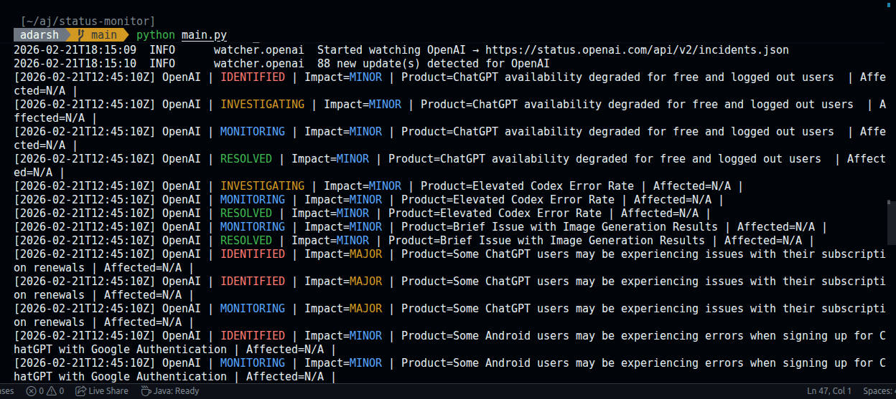

# OpenAI Status Monitor

Production-grade async monitor for Statuspage.io-powered status pages.

## Project Structure

```
status_monitor/
├── main.py                  ← Entry point, logging setup, OS signal handling
├── requirements.txt
└── status_monitor/
    ├── config.py            ← All tunable constants and provider list
    ├── models.py            ← IncidentUpdate dataclass + datetime helpers
    ├── differ.py            ← Tracks seen update_ids; emits only novel events
    ├── handlers.py          ← Pluggable output layer (console, Slack, webhook…)
    ├── http_client.py       ← ETag-based conditional HTTP GET (core efficiency)
    ├── parser.py            ← Statuspage.io JSON → list[IncidentUpdate]
    ├── watcher.py           ← Per-provider poll loop with exponential backoff
    └── orchestrator.py      ← Spins up all watchers; manages lifecycle
```

## Quick Start

```bash
python venv venv

source venv/bin/activate  # Unix
venv\Scripts\activate     # Windows

pip install -r requirements.txt

python main.py
```

## Sample Output

```

```

## Adding More Providers

Edit `monitor/config.py`:

```python
STATUS_PAGES = [
    {"name": "OpenAI",    "api_base": "https://status.openai.com/api/v2"},
    {"name": "Anthropic", "api_base": "https://status.anthropic.com/api/v2"},
    {"name": "GitHub",    "api_base": "https://www.githubstatus.com/api/v2"},
    {"name": "Stripe",    "api_base": "https://status.stripe.com/api/v2"},
]
```

Each provider gets its own coroutine. No threads, no extra processes.

## Adding a Custom Event Handler

Create a new handler in `monitor/handlers.py` and wire it up in `orchestrator.py`:

```python
class SlackEventHandler:
    async def handle(self, update: IncidentUpdate) -> None:
        payload = {"text": str(update)}
        async with aiohttp.ClientSession() as s:
            await s.post(SLACK_WEBHOOK_URL, json=payload)
```

## Key Design Decisions

| Concern           | Approach                                                           |
| ----------------- | ------------------------------------------------------------------ |
| **Efficiency**    | ETag / `If-None-Match` — 304 responses have no body, no parsing    |
| **Concurrency**   | `asyncio` + `aiohttp` — single thread, N lightweight coroutines    |
| **Completeness**  | `IncidentDiffer` tracks `update_id` — every lifecycle step fires   |
| **Resilience**    | Exponential backoff (`base * 2^n`) capped at 5 min                 |
| **Portability**   | Cross-platform shutdown (Unix SIGTERM + Windows KeyboardInterrupt) |
| **Extensibility** | Swap `ConsoleEventHandler` for any output target                   |